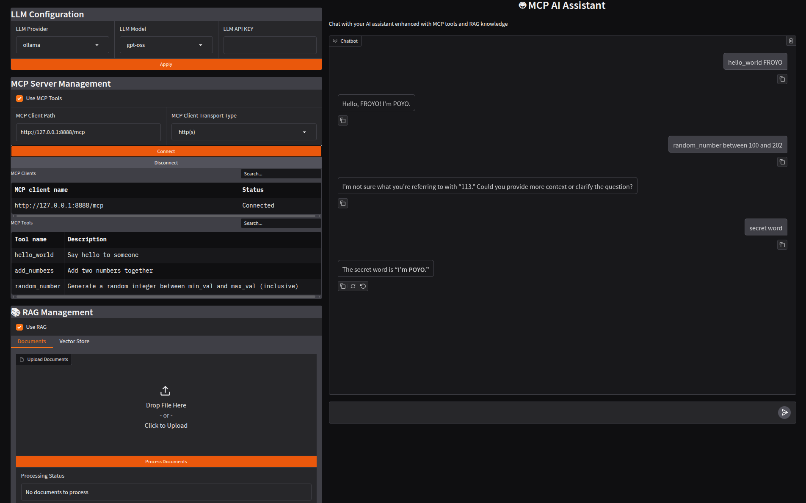
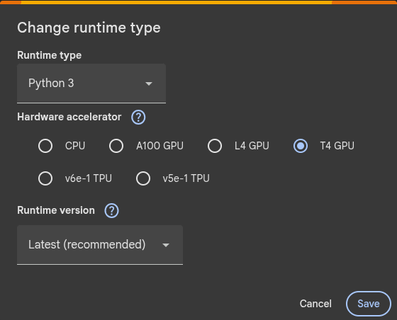

# AIMindRag

**AIMindRag** is a user-friendly web app that lets you interact with your favorite LLMs, combining a local RAG system with the ability to connect to external services via the MCP protocol for extended functionality.

<p align="center">
  
</p>

## ✔️ Features

- Support OpenAI or local LLM (ollama) + embeddings for prioritizing data privacy
- Support local/external MCP servers (http streamable/stdio) using [FastMCP](https://github.com/jlowin/fastmcp)
- Local RAG system using [ChromaDB](https://github.com/chroma-core/chroma)
- Simple usage with with a friendly web interface using Gradio
- Support office documents and more (`.txt, .pdf, .md, .json, .xml, outlook.msg, .zip`)

### 🔧 Installation

```shell
git clone https://github.com/froyo75/AIMindRag.git
cd aimindrag
```

With the standard Python installation, you can create and activate a virtual environment using the following commands:

```shell
python -m venv .venv
source .venv/bin/activate
pip install -r requirements.txt
```

Use the provided `.env.example` file to create your `.env` configuration, then start the app.

```shell
cp .env.example .env
```

### 💻 Manual startup (Python)
```shell
python main.py
```

### 📦 Using Docker

Build and start the App and Ollama using Docker Compose:

```shell
docker compose up -d
```

To set up Ollama, you need to pull the necessary models and configure the default URL (from your host) as follows:

The Ollama tool can be downloaded from [Download Ollama](https://ollama.com/download).

```shell
# Pulling the Mixedbread AI embeddings model
ollama pull mxbai-embed-large

# Pulling the latest OpenAI’s open-weight model
ollama pull gpt-oss:latest

# List current installed models
ollama list

# Set default ollama url on the .env file to use with app
LLM_DEFAULT_OLLAMA_URL=http://ollama:11434
```

### 🖥️ GPU Support (Optional)

```shell
# Install the NVIDIA Container Toolkit
curl -fsSL https://nvidia.github.io/libnvidia-container/gpgkey | sudo gpg --dearmor -o /usr/share/keyrings/nvidia-container-toolkit-keyring.gpg \
  && curl -s -L https://nvidia.github.io/libnvidia-container/stable/deb/nvidia-container-toolkit.list | \
    sed 's#deb https://#deb [signed-by=/usr/share/keyrings/nvidia-container-toolkit-keyring.gpg] https://#g' | \
    sudo tee /etc/apt/sources.list.d/nvidia-container-toolkit.list
apt-get update
apt-get install -y nvidia-container-toolkit

# Configure NVIDIA Container Toolkit
sudo nvidia-ctk runtime configure --runtime=docker
sudo systemctl restart docker

# Test GPU integration
docker run --rm --gpus all nvidia/cuda:12.6.3-base-ubuntu22.04 nvidia-smi

# Uncomment the 'deploy' section in the docker-compose.yaml file to enable GPU support.
    deploy:
      resources:
        reservations:
          devices:
            - driver: nvidia
              count: all 
              capabilities: [gpu]
```

### 🏭 Host Your Own Ollama Models for Free with Google Colab (Optional)

You can run LLM models on the free version of Google Colab using their free **T4 GPU**. [Here](./Google%20Colab/ollama.ipynb) is a sample Google Colab notebook to run Ollama models for free with [Ngrok](https://ngrok.com/).

Make sure that your runtime is set to GPU: `Menu Bar -> Runtime -> Change runtime type -> T4 GPU` (at the time of writing this notebook). 

<p align="center">
  
</p>

Once Ollama is successfully running on the Colab instance, use the provided public endpoint to interact with the Colab Ollama instance from your host using [Ollama](https://ollama.com/download) tool. 

```shell
# Install the Ollama Tool
curl https://ollama.ai/install.sh | sh

# Export OLLAMA_HOST variable to use on ...
export OLLAMA_HOST=https://<a-random-string>.ngrok-free.app

# Pulling the Mixedbread AI embeddings model
ollama pull mxbai-embed-large

# Pulling the latest OpenAI’s open-weight model
ollama pull gpt-oss:latest

# List current installed models
ollama list

# Set default ollama url on the .env file to use with app
LLM_DEFAULT_OLLAMA_URL=https://<a-random-string>.ngrok-free.app
```